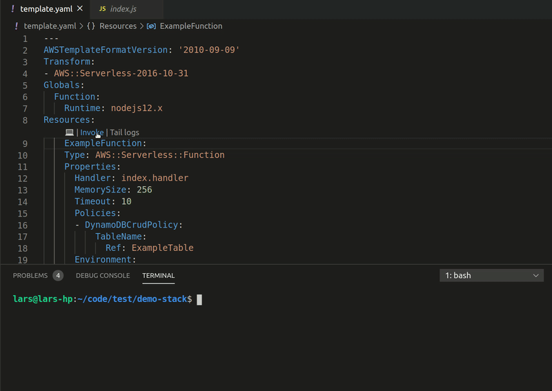
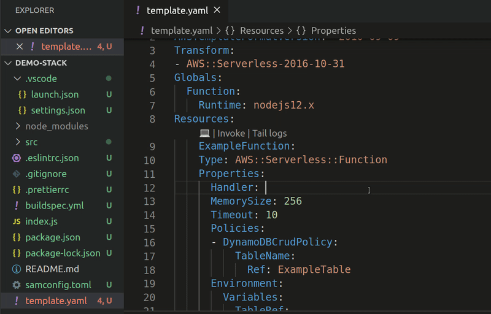
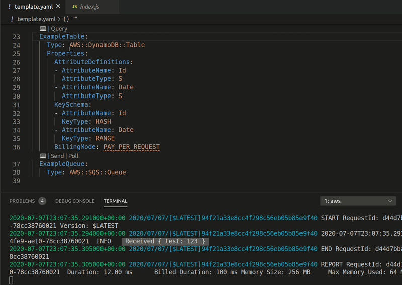
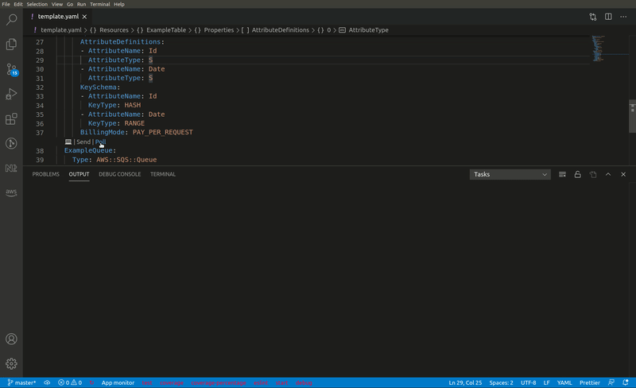
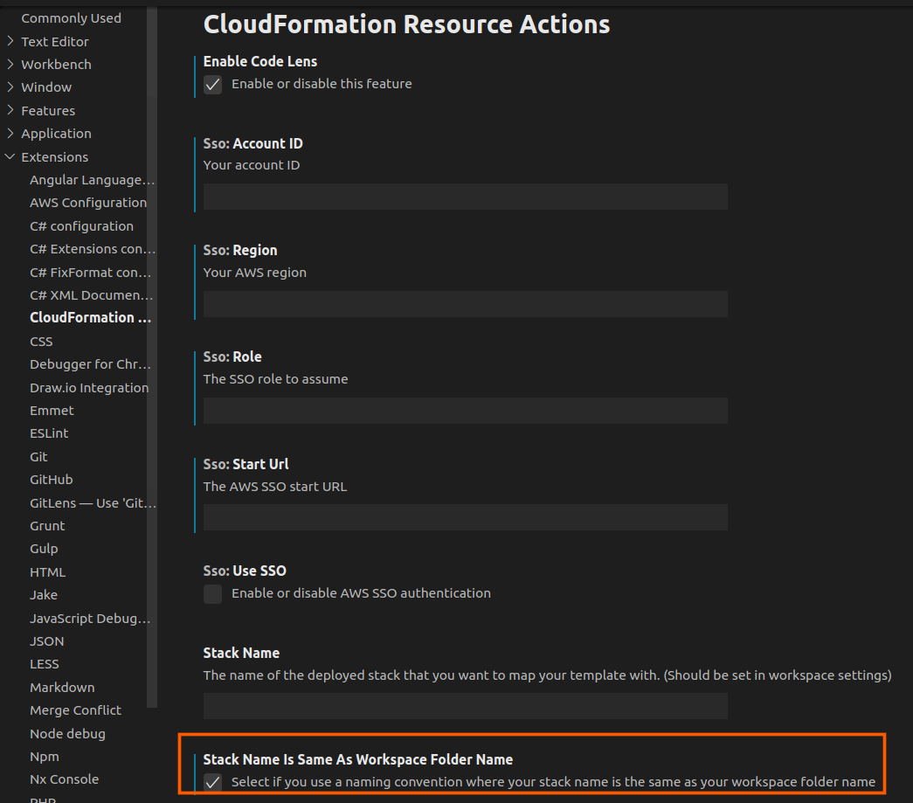

# cfn-resource-actions

## Features

VS Code extension that lets you perform actions against deployed AWS resources directly from the CloudFormation/SAM template.

The current version supports the following actions. More to follow in later versions:

* AWS::Serverless::Function / AWS::Lambda::Function:
  * Tail logs in terminal output
  * Invoke function
  * F12 / ctrl+click to handler code (NodeJS/Python/.NET Core only)
    * .NET Core if default folder based namespace structure is followed
* AWS::DynamoDB::Table / AWS::Serverless::SimpleTable:
  * Query table from VS code and get the result in the output tab
* AWS::SNS::Topic
  * Publish message to topic
* AWS::SQS::Queue
  * Send message to queue
  * Poll queue

## Examples
Invoking lambda function and tailing its logs:

---
Lambda handler code navigation (F12/ctrl+click):

---
DynamoDB query:

---
SQS send and poll:

---

## Installation
`ext install ljacobsson.cfn-resource-actions`

The extension activates on the following criteria:
```
[
  "onCommand:cfn-resource-actions.enableCodeLens",
  "workspaceContains:**/serverless.template",
  "workspaceContains:**/template.yml",
  "workspaceContains:**/template.yaml",
  "workspaceContains:**/template.json"
]
```

**NOTE**
The first time you open a project that conforms to the above rules you will get prompted to enter the stack's name. This is so the extension can fetch information about the stack from CloudFormation. This can be modified in {workspace}/.vscode/settings.json:
```
{
    "cfn-resource-actions.stackName": "my-cfn-stack"
}
```

### Tip
If you follow a naming convention where your deployed stack has the same name as your workspace's root folder, then enable the following global setting:



## Requirements

A configured AWS CLI with the following permissions: 
```
{
  "Version": "2012-10-17",
  "Statement": [
    {
      "Sid": "StatementId",
      "Effect": "Allow",
      "Action": [
        "cloudformation:ListStackResources"
        "dynamodb:DescribeTable",
        "dynamodb:Query",
        "lambda:Invoke",
        "sns:Publish",
        "sqs:SendMessage",
        "sqs:ReceiveMessage",
        "logs:CreateExportTask",
        "states:StartExecution"
        "sts:GetCallerIdentity"
      ]
    }
  ]
}
```

## Using AWS SSO auth
In the global settings.json file, add the following parameters:
```
"cfn-resource-actions.sso.region": "eu-west-1",
"cfn-resource-actions.sso.role": "RoleToAssume",
"cfn-resource-actions.sso.startUrl": "https://you-sso-subdomain.awsapps.com/start",
"cfn-resource-actions.sso.accountId": "123456789012",
"cfn-resource-actions.sso.useSSO": true
```

## Known Issues

Does not reload based on updates to your template. To map with the latest version of the stack, disable and re-enable the extension

