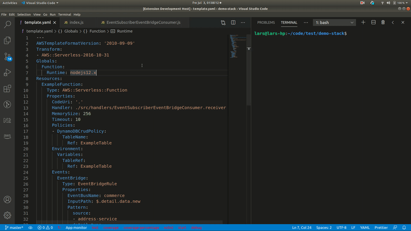

# cfn-resource-actions README

_This is work in progress and not yet released to the marketplace _

## Features

VS Code extension that lets you perform actions against deployed AWS resources directly from the CloudFormation/SAM template.

The current version supports the following actions:

* AWS::Serverless::Function / AWS::Lambda::Function:
* * Open Lambda console for a given function in the browser
* * Tail logs in terminal output
* AWS::DynamoDB::Table / AWS::Serverless::SimpleTable:
* * Open DynamoDB console for a given table in the browser
* * Query table from VS code and get the result in the output tab





## Requirements

A configured AWS CLI with the following permissions: 
```
{
  "Version": "2012-10-17",
  "Statement": [
    {
      "Sid": "StatementId",
      "Effect": "Allow",
      "Action": [
        "cloudformation:ListStackResources"
        "dynamodb:DescribeTable",
        "dynamodb:Query",
        "logs:CreateExportTask",
      ]
    }
  ]
}
```

## Known Issues

Does not yet support AWS SSO authentication

# cfn-resource-actions
