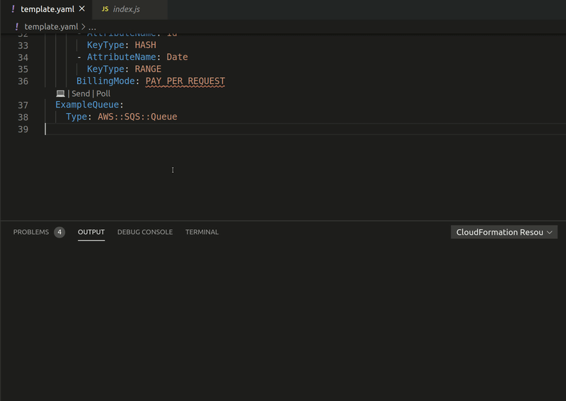

# cfn-resource-actions
[](https://marketplace.visualstudio.com/items?itemName=https://marketplace.visualstudio.com/items?itemName=ljacobsson.cfn-resource-actions)
[](https://marketplace.visualstudio.com/items?itemName=https://marketplace.visualstudio.com/items?itemName=ljacobsson.cfn-resource-actions)
[](https://marketplace.visualstudio.com/items?itemName=https://marketplace.visualstudio.com/items?itemName=ljacobsson.cfn-resource-actions)

## Features

VS Code extension that lets you perform actions against deployed AWS resources directly from the CloudFormation/SAM template.

The current version supports the following actions. More to follow in later versions:

* `AWS::Serverless::Function` / `AWS::Lambda::Function`:
  * Tail logs in terminal output
  * Invoke function
  * F12 / ctrl+click to handler code (NodeJS/Python/.NET Core only)
    * .NET Core if default folder based namespace structure is followed
  * See XRay statistics of average duration, error rate and throttle rate
* `AWS::DynamoDB::Table`
  * Query table from VS code and get the result in the output tab
* `AWS::Events::Rule`
  * Query table from VS code and get the result in the output tab
* `AWS::SNS::Topic`
  * Publish message to topic
* `AWS::SQS::Queue`
  * Send message to queue
  * Poll queue
* `AWS::StepFunctions::Statemachine`
  * Start execution

_All listed resource types also provide a link to its AWS console location (`↗`)_

_All resources provide a button to copy a resource's physical ID to the clipboard (📋)_

_All resources provide a menu that lists the resources referrable attributes along with a link to the documentation (☰)_

## Examples

### Invoking lambda function and tailing its logs:


### Lambda handler code navigation (F12/ctrl+click):


### DynamoDB query:


### SQS send and poll:


### Deploy stack and check for drift:


### Visualize stack:


Using the fantastic [Draw.io Integration](https://marketplace.visualstudio.com/items?itemName=hediet.vscode-drawio) extension by Henning Dietrichs. (You'll need to install the extension to visualize)

### Test EventBridge rules:


This uses the backend for evb-cli. For this feature to work, please follow the instructions to set up local debugging from [evb-cli's readme](https://github.com/mhlabs/evb-cli/blob/master/README.md#local-debugging)

## Installation
`ext install ljacobsson.cfn-resource-actions`

The extension activates on the following criteria:
```
[
  "onCommand:cfn-resource-actions.enable",
  "workspaceContains:**/serverless.template",
  "workspaceContains:**/template.yml",
  "workspaceContains:**/template.yaml",
  "workspaceContains:**/template.json"
]
```

**NOTE**
The first time you open a project that conforms to the above rules you will get prompted to enter the stack's name. This is so the extension can fetch information about the stack from CloudFormation. This can be modified in {workspace}/.vscode/settings.json:
```
{
    "cfn-resource-actions.stackName": "my-cfn-stack"
}
```

### Tip
If you follow a naming convention where your deployed stack has the same name as your workspace's root folder, then enable the following global setting:


## Requirements

A configured AWS CLI with the following permissions: 
```
{
  "Version": "2012-10-17",
  "Statement": [
    {
      "Sid": "StatementId",
      "Effect": "Allow",
      "Action": [
        "cloudformation:ListStackResources",
        "cloudformation:DescribeStacks",
        "cloudformation:DetectStackDrift",
        "dynamodb:DescribeTable",
        "dynamodb:Query",
        "schemas:DescribeSchema",
        "lambda:Invoke",
        "sns:Publish",
        "sqs:SendMessage",
        "sqs:ReceiveMessage",
        "logs:CreateExportTask",
        "states:StartExecution",
        "sts:GetCallerIdentity",
        "xray:getTraceSummaries"
      ]
    }
  ]
}
```
